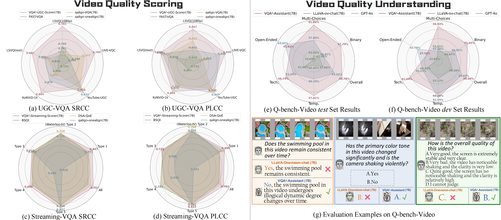
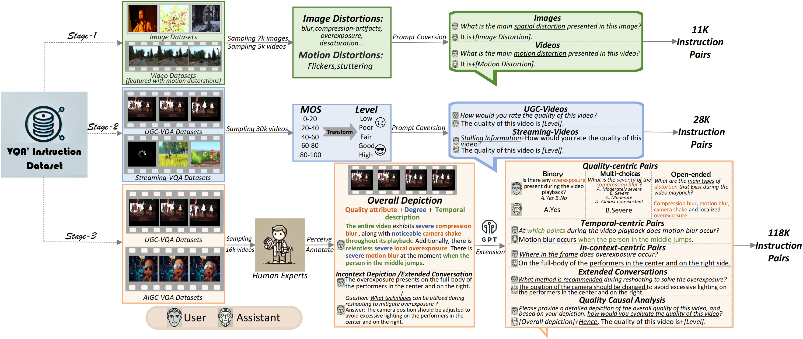
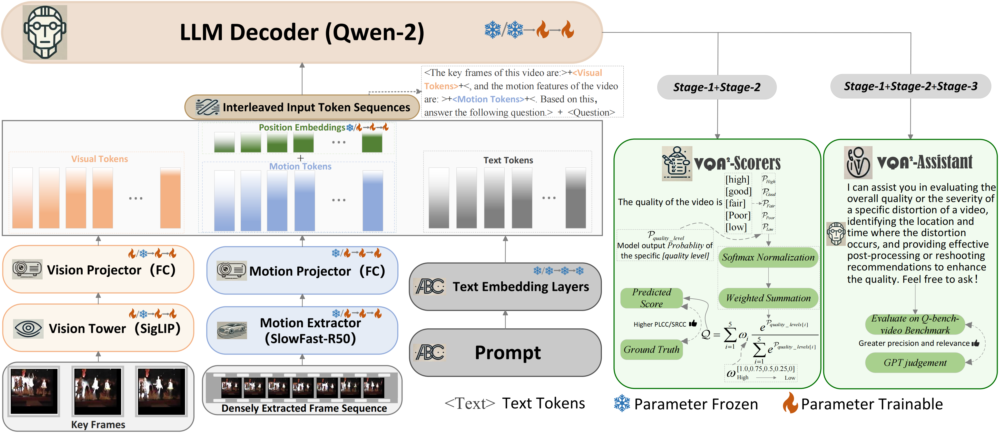

<div align="center">
  
<a href="https://arxiv.org/abs/2411.03795"></a>
  
</div>
</div>
    
  <h1> VQA²-Visual-Question-Answering-for-Video-Quality-Assessment</h1>

<div>

Official code and dataset for VQA² series models and dataset

## 🔥Exellent Performance on Video Quality Scoring and Video Quality Understanding!!!
 <div style="width: 100%; text-align: center; margin:auto;">
      
  </div>

## 🔥Dataset Construction Pipeline:
<div style="width: 100%; text-align: center; margin:auto;">
      
  </div>

## 🔥Model Structure:
<div style="width: 100%; text-align: center; margin:auto;">
      
  </div>
  
## 🔖 TODO：
- [√] Release testing and training code.
- [√] Release model weights.
- [√] Release the stage-2 instruction dataset.
- [√] Release the stage-3 instruction dataset.
- [ ] Provide HuggingFace demo.
- [ ] 🔥🔥🔥ULTRA-TARGET: Scaling up the dataset to over 1,000,000 pairs.

## Quicker Start:
Install dependencies:
```shell
cd VQA_main
conda create -n VQA python=3.10 -y
conda activate VQA
pip install --upgrade pip  # Enable PEP 660 support.
pip install -e ".[train]"
pip install pytorchvideo #For slowfast base model download
pip install transformers==4.44.0 #Change the transformers version
```
NOTE!!!
Replace the 

your_env_dir/VQA/lib/python3.10/site-packages/transformers/models/qwen2/modeling_qwen2.py 

to 

VQA_main/modeling_qwen2.py (we set some customized parameters in it).

## VQA² Scorers: 
cd VQA_main

For UGC-Video Scoring:
```shell
python ./llava/eval/model_score_UGC.py
```
For Streaming-Video Scoring:
```shell
python ./llava/eval/model_score_streaming.py
```
## VQA² Assistant: 
cd VQA_benchmark_test

For Q-bench-video Evaluation:
```shell
python ./llava/eval/model_vqa_q_bench_video.py
```
For Simple Q&A:
```shell
python ./llava/eval/model_conv.py
```
Gradio demo:
```shell
python ./app.py #Note that the minimum GPU requirement is 3090(24G)*1.
```
## Training
cd VQA_main
```shell
chmod +x ./scripts/train/finetune_VQA².sh
```
Then directly execute this .sh file. Note that we only support training with per_device_train_batch_size=1.

## Training Dataset
Stage2-streaming (2K): https://huggingface.co/datasets/q-future/VQA-stage2-streaming (q-future/VQA-stage2-streaming)
Stage3 (14.3K mix/11.6K only): https://huggingface.co/datasets/q-future/VQA-stage3 (q-future/VQA-stage3)

NOTE!!! The stage2-UGC part is in Stage3-mix part in https://huggingface.co/datasets/q-future/VQA-stage3

## Model Zoo
We temporarily provide the huggingface weight of VQA²-UGC-Scorer(7B) ,VQA²-Streaming-Scorer(7B), and VQA²-Assistant(7B); more versions will be released later.

HF-PATH:

VQA²-UGC-Scorer(7B): https://huggingface.co/q-future/VQA-UGC-Scorer (q-future/VQA-UGC-Scorer)

VQA²-Streaming-Scorer(7B): https://huggingface.co/q-future/VQA-Streaming-Scorer (q-future/VQA-Streaming-Scorer)

VQA²-Assistant(7B): https://huggingface.co/q-future/VQA-Assistant (q-future/VQA-Assistant)

## Citation

If you consider this work interesting, please feel free to cite it in your work!

```bibtex
@article{jia2024vqa,
  title={VQA $\^{} 2$: Visual Question Answering for Video Quality Assessment},
  author={Jia, Ziheng and Zhang, Zicheng and Qian, Jiaying and Wu, Haoning and Sun, Wei and Li, Chunyi and Liu, Xiaohong and Lin, Weisi and Zhai, Guangtao and Min, Xiongkuo},
  journal={arXiv preprint arXiv:2411.03795},
  year={2024}
}
}
@article{zhang2024q,
  title={Q-Bench-Video: Benchmarking the Video Quality Understanding of LMMs},
  author={Zhang, Zicheng and Jia, Ziheng and Wu, Haoning and Li, Chunyi and Chen, Zijian and Zhou, Yingjie and Sun, Wei and Liu, Xiaohong and Min, Xiongkuo and Lin, Weisi and others},
  journal={arXiv preprint arXiv:2409.20063},
  year={2024}
}
```


