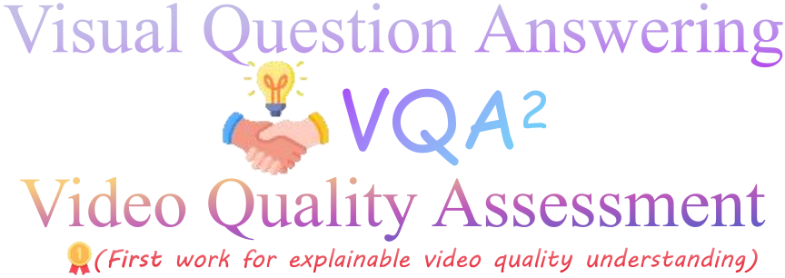
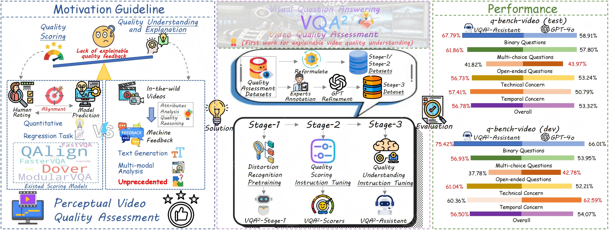
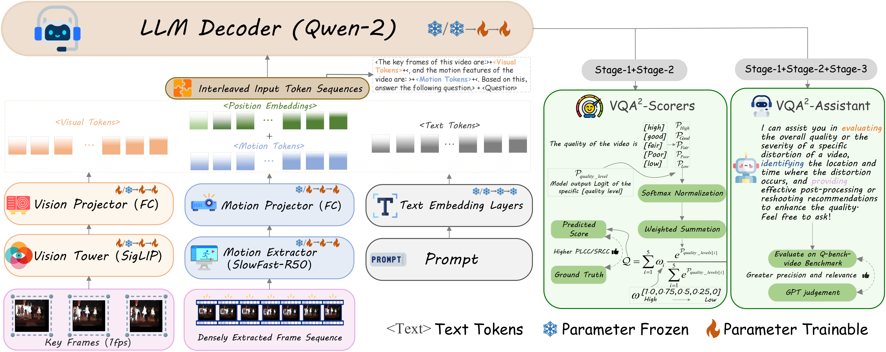

<div align="center">
    
    
 <div>
    <a href="https://github.com/Q-Future/Visual-Question-Answering-for-Video-Quality-Assessment"></a>
    <a href="https://arxiv.org/abs/2411.03795"></a>
    <a href="https://huggingface.co/datasets/q-future"></a>
    <a href="https://huggingface.co/datasets/q-future"></a>
   </div>

<div style="width: 100%; text-align: center; margin:auto;">
      
  </div>
  
  <h1>VQA²: Visual Question Answering for Video Quality Assessment</h1>
  
_[ACMMM2025] Official code and dataset for VQA² series models and dataset_

_Built upon <a href="https://github.com/LLaVA-VL/LLaVA-NeXT" target="_blank">LLaVA-Onevision</a>_

  <div>
      <a href="https://github.com/jzhws" target="_blank">Ziheng Jia</a><sup>1</sup><sup>*</sup>,
      <a href="https://zzc-1998.github.io/" target="_blank">Zicheng Zhang</a><sup>1</sup><sup>*</sup>,
      <a href="https://github.com/2022qjy" target="_blank">Jiaying Qian</a><sup>1</sup>,
      <a href="https://teowu.github.io/" target="_blank">Haoning Wu</a><sup>2</sup>,
      <a href="https://scholar.google.com/citations?hl=zh-CN&user=nDlEBJ8AAAAJ" target="_blank">Wei Sun</a><sup>1</sup>,
      <a href="https://github.com/lcysyzxdxc" target="_blank">Chunyi Li</a><sup>1</sup><sup>*</sup>,
  </div>

<div>
      <a href="https://scholar.google.ca/citations?user=Tq2hoMQAAAAJ&hl=en" target="_blank">Xiaohong Liu</a><sup>1</sup>,
      <a href="https://personal.ntu.edu.sg/wslin/Home.html" target="_blank">Weisi Lin</a><sup>2</sup>,
      <a href="https://ee.sjtu.edu.cn/en/FacultyDetail.aspx?id=24&infoid=153&flag=153" target="_blank">Guangtao Zhai</a><sup>1</sup>
      <a href="https://scholar.google.com/citations?user=91sjuWIAAAAJ&hl=zh-CN&oi=ao" target="_blank">Xiongkuo Min</a><sup>1</sup><sup>#</sup>,
      
  </div>


  
  <div>
  <sup>1</sup>Shanghai Jiaotong University,  <sup>2</sup>Nanyang Technological University
       </div>   
<div>
<sup>*</sup>Equal contribution. <sup>#</sup>Corresponding author. 
   </div>
  <div style="width: 100%; text-align: center; margin:auto;">
      
  </div>

  <div style="width: 100%; text-align: center; margin:auto;">
      
  </div>

<div align="left">
    

## Release News
- 🔥[2025/7/10] Now the <a href="https://github.com/jzhws" target="_blank">VQA²-Assistant(7B)-enhanced</a> can handle video/image quality scoring/interpreting in an unified model.
- 🔥[2025/7/5] Better than noting, our work has been finally accepted by ACMMM 2025.
- 🔥[2025/5/4] We have updated the video training pipeline for our model on Qwen2.5-VL (https://github.com/Q-Future/Visual-Question-Answering-for-Video-Quality-Assessment/tree/main/VQA%C2%B2-qwen2-5_finetune), which is 4× memory efficient compared to llava-ov (Thanks to the owners of repository https://github.com/2U1/Qwen2-VL-Finetune !). 
- 🔥[2025/5/4] We have updated a new version of enhanced VQA²-Assistant (llava-ov) with better output style and benchmark performance (https://huggingface.co/q-future/VQA-Assistant-llava-qwen-enhanced).
- 🔥[2025/1/31] We have released the refined code and more detailed dataset, making sure that the results in the paper are reproducible.
- 🔥[2024/12/20] We have replaced or fixed some code files in VQA_main to ensure the training process is reproducible. Now the training process can be implemented as long as your environment configuration strictly follows our guidelines！


  
## 🔖 TODO：
- 🎯[√] Release testing and training code.
- 🎯[√] Release model weights.
- 🎯[√] Release the stage-2 instruction dataset.
- 🎯[√] Release the stage-3 instruction dataset.
- 🎯[√] Release the training code on the famous Qwen2.5-VL.

## Quicker Start:
Install dependencies:
```shell
cd VQA_main
conda create -n VQA python=3.10 -y
conda activate VQA
pip install --upgrade pip
pip install -e ".[train]"
pip install pytorchvideo
pip install transformers==4.44.0 
```
Fix：[2024.12.20] Please download the initialized slowfast.pth (https://huggingface.co/JZHWS/slowfast) and load the pretrained model in "llava\model\slowfast\builder.py"(line 11) to make sure the model initialization is implementable since the model downloaded through pytorchvideo includes meta tensors.


## VQA² Scorers: 
cd quality_scoring

```shell
python ./llava/eval/model_score_video.py (for video)

python ./llava/eval/model_score_image.py (for image)
```

## VQA² Assistant: 
cd quality_interpreting

For Q-bench-video Evaluation:
```shell
python ./llava/eval/model_vqa_q_bench_video.py
```

For image Evaluation:
```shell
python ./llava/eval/model_vqa_image.py
```

Gradio demo:
```shell
python ./app.py #Note that the minimum GPU requirement is 3090(24G)*1.
```
## Training
cd quality_interpreting
```shell
chmod +x ./scripts/train/finetune_VQA².sh
```
Then directly execute this .sh file. Note that we only support training with per_device_train_batch_size=1.

## Training Dataset
Stage-2-streaming (2.1K): https://huggingface.co/datasets/q-future/VQA-stage2-streaming (q-future/VQA-stage2-streaming)

Stage-3 (14.3K mix/11.6K only): https://huggingface.co/datasets/q-future/VQA-stage3 (q-future/VQA-stage3)

NOTE!!! The Stage-2-UGC part is in Stage3-mix part in https://huggingface.co/datasets/q-future/VQA-stage3

## Model Zoo
We temporarily provide the huggingface weight of VQA²-UGC-Scorer(7B) ,VQA²-Streaming-Scorer(7B), and VQA²-Assistant(7B); more versions will be released later.

HF-PATH:

VQA²-UGC-Scorer(7B): https://huggingface.co/q-future/VQA-UGC-Scorer-llava_qwen (q-future/VQA-UGC-Scorer-llava_qwen)

VQA²-Streaming-Scorer(7B): https://huggingface.co/q-future/VQA-Streaming-Scorer-llava_qwen (q-future/VQA-Streaming-Scorer-llava_qwen)

VQA²-Assistant(7B): https://huggingface.co/q-future/VQA-Assistant-llava_qwen (q-future/VQA-Assistant-llava_qwen)

VQA²-Assistant(7B)-enhanced (for video and images): https://huggingface.co/q-future/VQA-Assistant-llava-qwen-enhanced (q-future/VQA-Assistant-llava-qwen-enhanced)

## Citation

If you consider this work interesting, please feel free to cite it in your work!

```bibtex

@article{jia2024vqa,
  title={VQA $\^{} 2$: Visual Question Answering for Video Quality Assessment},
  author={Jia, Ziheng and Zhang, Zicheng and Qian, Jiaying and Wu, Haoning and Sun, Wei and Li, Chunyi and Liu, Xiaohong and Lin, Weisi and Zhai, Guangtao and Min, Xiongkuo},
  journal={arXiv preprint arXiv:2411.03795},
  year={2024}
}
}
@article{zhang2024q,
  title={Q-Bench-Video: Benchmarking the Video Quality Understanding of LMMs},
  author={Zhang, Zicheng and Jia, Ziheng and Wu, Haoning and Li, Chunyi and Chen, Zijian and Zhou, Yingjie and Sun, Wei and Liu, Xiaohong and Min, Xiongkuo and Lin, Weisi and others},
  journal={arXiv preprint arXiv:2409.20063},
  year={2024}
}
```


